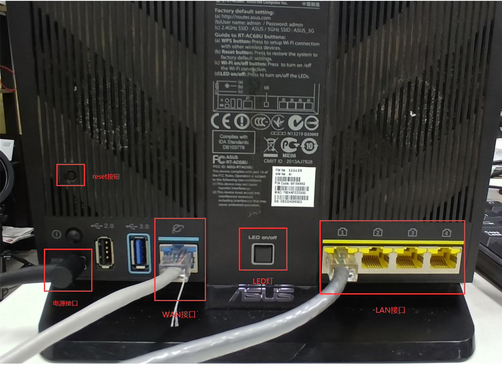
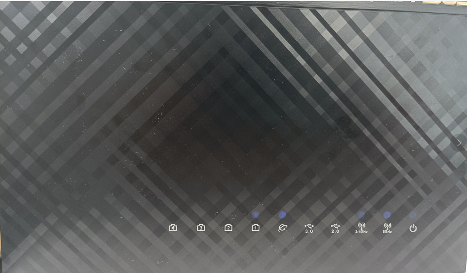
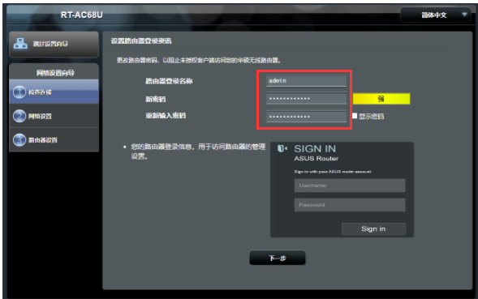
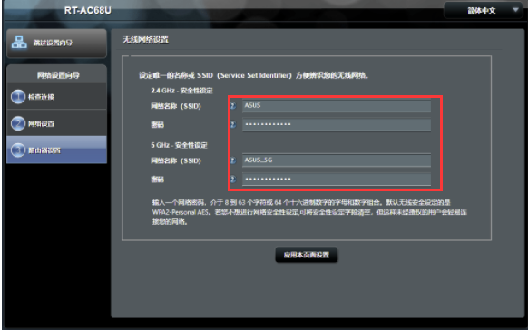
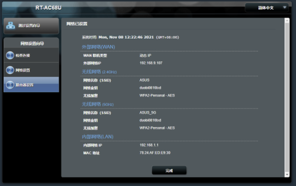
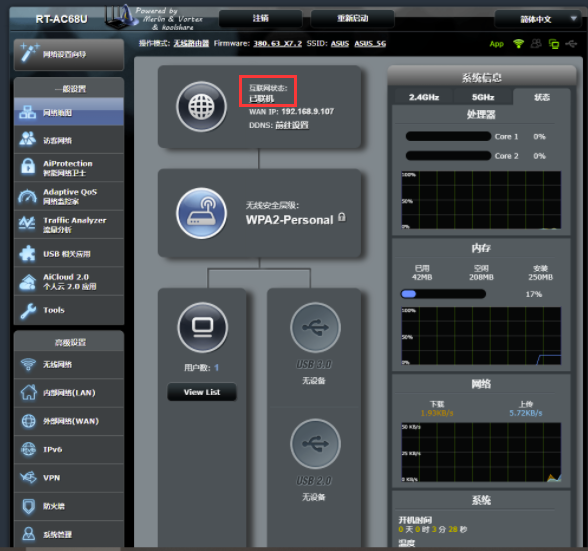
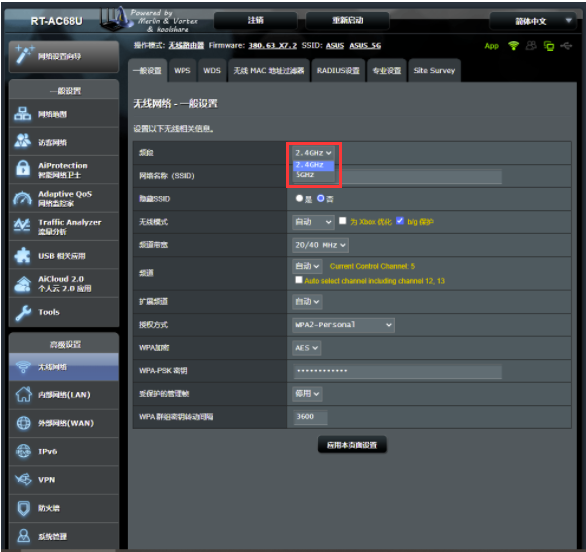
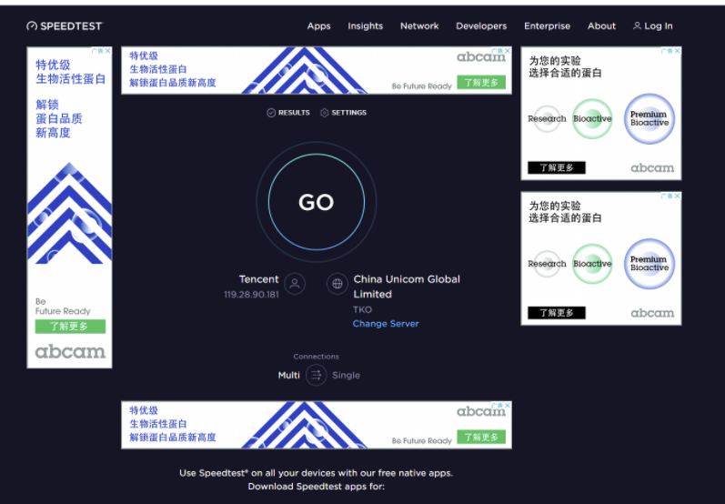
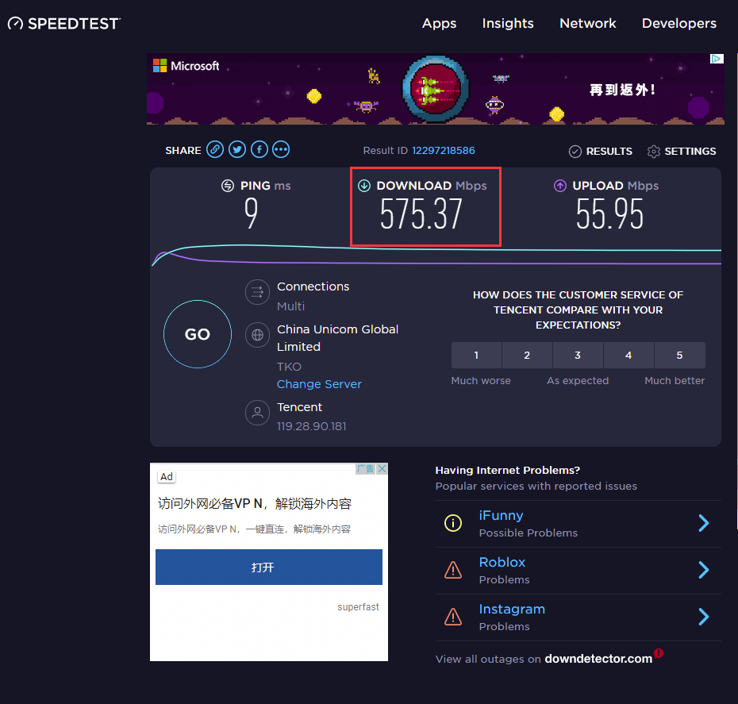

# **如何配置新买的路由器**

**步骤一：**

插上路由器的电源。

**步骤二：**

在路由器的LAN口（一般是标有黄色的接口）用网线连接电脑的网路接口。如下图：

**步骤三：**

将网线接入路由器的WAN口（一般是标有蓝色的接口）。如下图：

**步骤四：**

按下路由器的reset按钮不放手（大概5秒钟），观察路由器的灯，当路由器的灯变闪烁，说明重置路由器成功，松手。如下图：

**步骤五：**

这时电脑上会弹出路由器的配置框。在此输入你新的密码（密码随意填）。点击下一步。如下图：

**步骤六：**

无线网络设置，有2.4GHZ和5GHZ两个频段，在此输入密码，并点击引用本页面设置。如下图：

**步骤七：**

网路设置成功，点击完成按钮。如下图：

**步骤八：**

可以看到你路由器的网路状态以及当前的网速。这时候就可以正常连接WiFi上网了。如下图：

**speedtest**是一个专门测试网速的软件，点击GO等待几分钟，软件会自动帮你测试你当前的路由器的网速。如下图：

