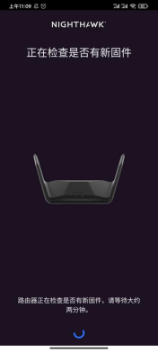

**配置WiFi路由器连上WiFi步骤：**

1、打开路由器，把路由器的天线打开，再打开路由器的开关，接上电源。这时电源的灯会闪烁并且变亮，注意看每个路由器上面都会有路由器的名称和初始密码。记住这个名称和密码。

2、每个路由器都会有一个WAN口，还有3~4个LAN口，WAN口一般是黄色的，是用来连接外网用的，把外网线接入WAN口。

3、打开你手机上的WiFi可以看到路由器的WiFi名称，点击连接WiFi，会弹出输入密码框，输入路由器上的初始密码，连接成功。可以正常上网。

**4、修改初始密码：**

(1) 首先下载一个叫Nighthawk的app，打开Nighthawk app，扫面路由器上的二维码，会弹出如下图：点击继续

 

(2) 可以在此输入你的新密码，并记住你的新密码如下图：点击下一步

 

(3) 将外网接入路由器的WAN口，点击下一步

 

(4)点击复制密码，再点击转至无线设置

 

(5)在此设置管理员密码（密码可以随便输入），点击下一步

 

(6)设置安全问题，填写完之后，点击下一步。

 

(7)输入你之前设置的新密码，点击连接。

 

(8)点击打勾按钮。

 

(9)返回步骤(4),点击我已连接到WiFi,一直点击下一步

 

 

 

 

(10) 完成，弹出如下图：点击确定

 

(11)点击测试网速。如下图：

 

 (12)弹出如下图，可以测试自己的WiFi网速：

 

**如何查看WiFi路由器的网速：**

把电脑端的网线连接到WiFi路由器的LAN口上，在网页上输入网址：[https://www.speedtest.net/ ](https://www.speedtest.net/（测)（试网速用的）。点击GO开始测试WiFi路由器的网速。还可以点解Chang Server切换不同的地区测试网速。

